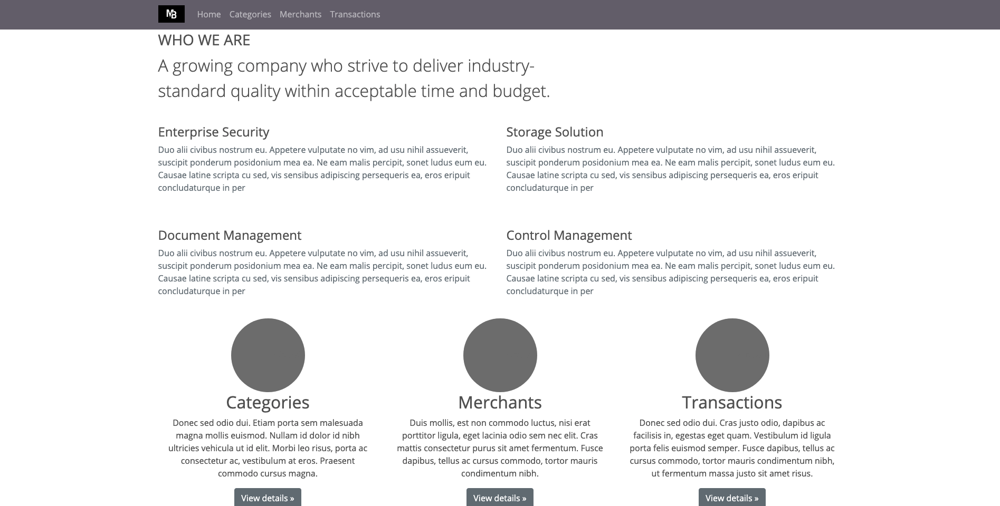

# Spending Tracker :dollar:

#### :seedling: Under Maintenance

A dynamic web application where the user can manage expenses to individual categories, then assign expenditure to one of those categories and display all transactions.




### Built With
* [Ruby](https://www.ruby-lang.org/en/)
* [Sinatra](http://sinatrarb.com/)
* [PostgreSQL](https://www.postgresql.org/)
* [Bootstrap](https://getbootstrap.com/)


### Project setup
Install required modules, create and seed database.

```ruby
bundle install
createdb spending_tracker
ruby db/seeds.rb
```

Using the project

Host the app locally using Sinatra, defaults to port 4567

```ruby
ruby app.rb
```
